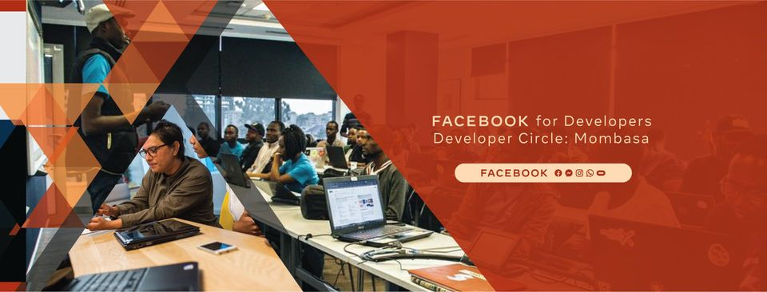

# Meta Developer Circle: Mombasa

# Developer Resources

> Open Source pool of resources useful to developers.

## Table of Contents

- Blogs
- GitHub Repositories
- YouTube Channels
- Documentions
- Development Environments
- Shell Extension

<!--  -->

## Blogs - Tech Bloggers/Blogs

- [Meta Developer Circle: Mombasa](https://dev.to/devcmombasa)
- [Chris Ndanyi: chrisdevcode](https://chrisdevcode.hashnode.dev/)
- [Meta Developer Circle: Nairobi](https://medium.com/devcnairobi)
- [Joan Ingari's Blog](https://dev.to/awinja_j)

## GitHub Repos

- [React Bootstrap Starter Template](https://github.com/achingachris/react-bootstrap-starter)

## Youtube Channels

- [Traversy Media](https://www.youtube.com/c/TraversyMedia)

## Documentation (Resources)

- [Tldraw - Draw Diagrams for README](https://github.com/tldraw/tldraw)
- [Update GitHub Contributions - GitHub Action](https://github.com/minicli/action-contributors)

## Development Environments

- [GitHub CLI](https://cli.github.com/)

## Shell Extension

- [Starship rs](https://starship.rs/)
- [oh-my-zsh](https://ohmyz.sh/)
- [Fish Shell](https://fishshell.com/)
